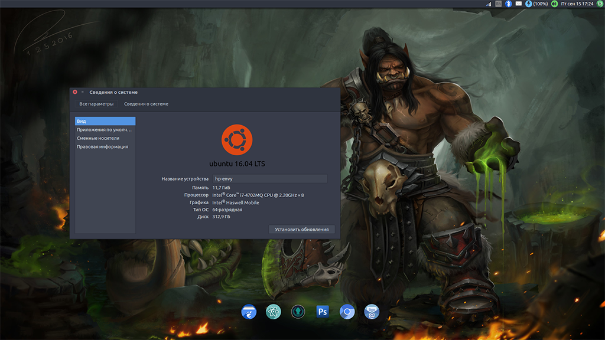
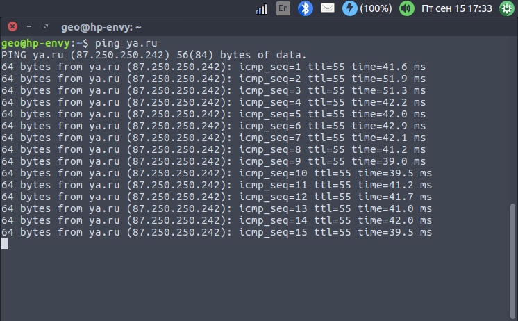
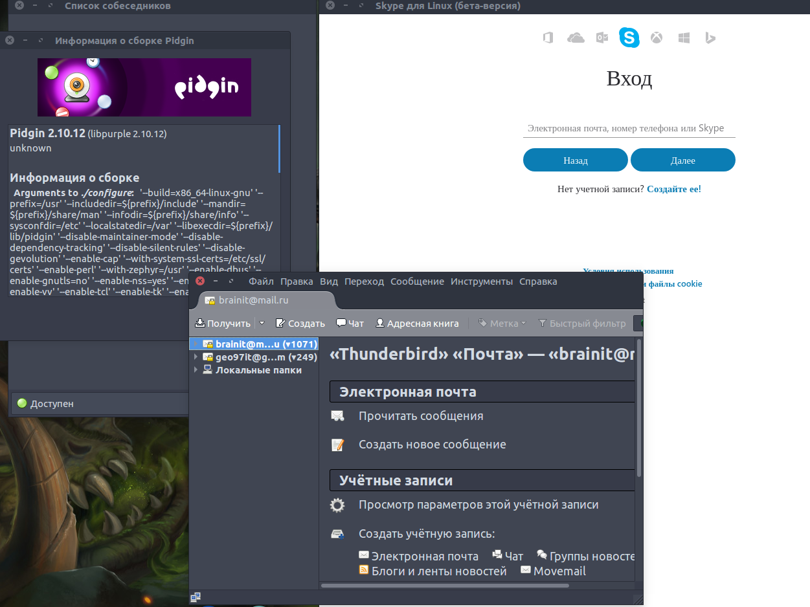

# Linux

## №1. Установка Ubuntu Linux

Дистрибутив Linux - Ubuntu установлен второй операционной системой рядом
с Windows 10.

## №2. Первичная настройка Ubuntu Linux

Соединение по домашнему wi-fi работает

Средства коммуникации установлены

## №3. Знакомство с консолью

* `man` - показывает страницу документации к консольной программе
* `cd` - сменить текущую директорию
* `ls` - посмотреть содержимое каталога
* `./` - текущий каталог
* `../` - родительский каталог
* `.~` - домашний каталог
* `/` корень файловой системы
* _абсолютный путь_ - путь, начиная с корня до конкретного файла: `/home/username`
* _отностельный путь_ - путь, относительно текущего каталога к заданому файлу: `../../project/js`

Приложения в bash можно запустить таким образом: `./program` или указав абсолютный путь
при этом должно быть достаточно прав на запуск программы а также у программы должен стоять атрибут  `+x` (разрешить исполнение)

Существует возможность перенаправлять потоки ввода, вывода, ошибок, а также делать некоторые
другие ухищрение подобного вида:
* `program < file.txt` - file.txt будет stdin программы
* `program > file.txt` - file.txt будет stdout программы
* `program 2> file.txt` - file.txt будет stderr программы
* `program >> file.txt` - добавить stdout программы в конец файла file.txt
* `program1 | program2` - конвейер, т.е. stdout program1 будет stdin program2

Все эти штуковины можно комбинировать: `program < in.txt 2> error.txt | other_program`,
`cat test.rb  | wc -l > line_count.txt`

Запустить процесс в фоне можно набрав `program &` или `program`, нажать `ctrl+z` и далее ввести `bg`
* `jobs` - выводит список задач в текущем bashе
* `fg` - перевести задачу на передний план, т.е. отображается в bashe
* `bg` - перевести задачу в фоновый режим, работает и не отображается в bashe

Остановить приложение можно, послав сигнал:
* SIGSTOP - приостановить процесс
* SIGTSTOP (`ctrl+z` в bash) - приостановить процесс
* SIGTERM - "завершись, пожалуйста", процесс завершиться нормально и освободит ресурсы
* SIGINT (`ctrl+c` в bash) - "завершись", завершить процесс, сигнал может быть проигнорирован
* SIGKILL - "прибить тапочком", убивает процесс, данный сигнал не может быть проигнорирован

Пример: запускаем telnet, что-то делаем и выходим нажатием `ctrl+c`

Команда `kill` - позволяет послать сигнал процессу

Команда `ps` - выводит информацию о запущенных процессах в системе

## №4. Знакомство с текстовым редактором Vim

Текстовый редактор vim имеет несколько режимов:
1. Режим команд - принимает ввод команд
2. Режим вставки - вводит набираемый текст
3. Визуальный режим - выделение текста

В командный режим можно перейти нажав `esc`, в остальные режимы необходимо переходить через командный режим. Для перехода в режим вставки можно нажать `i` для вставки текста в текущей позиции курсора, для перехода в визуальный режим `v`, `V`, `ctrl+v` - выделение символов, строк, прямоугольных областей текста соответственно.

Vim позволяет открывать несколько файлов, он имеет следующие подходы к работе с ними:
* Вкладки (вкладки, табы как в том же chrome, sublime text и т.д.)
* Буферы (своеобразный сеанс работы с файлом, похож на владки, но немного отличается)

При работе со вкладками vim запускается с опцией `-p` после которой указываются файлы.
Манипулировать вкладками можно следующими командами и сочетаниями клавиш:
* `:tabnew [имя_файла]` - открыть новую вкладку
* `:tabs` - список открытых вкладок
* `gt` или `:tabn` - следующая вкладка
* `gT` или `:tabp` - предыдущая вкладка
* `:tabfirst` - первая вкладка
* `:tablast` - последняя вкладка

При работе с буферами vim запускается с перечислением файлов, которые необходимо открыть.
Манипулировать буферами можно следующими способами:
* `:bn` - следующий буфер
* `:bp` - предыдущий буфер
* `:ls` - просмотреть список открытых буферов
* `:b имя_буфера` - переключиться на буфер по его имени
* `:bd [имя_буфера]` - удалить буфер по имени или текущий

> Всё остальное читать в "консольной обучалке" `vimtutor`
